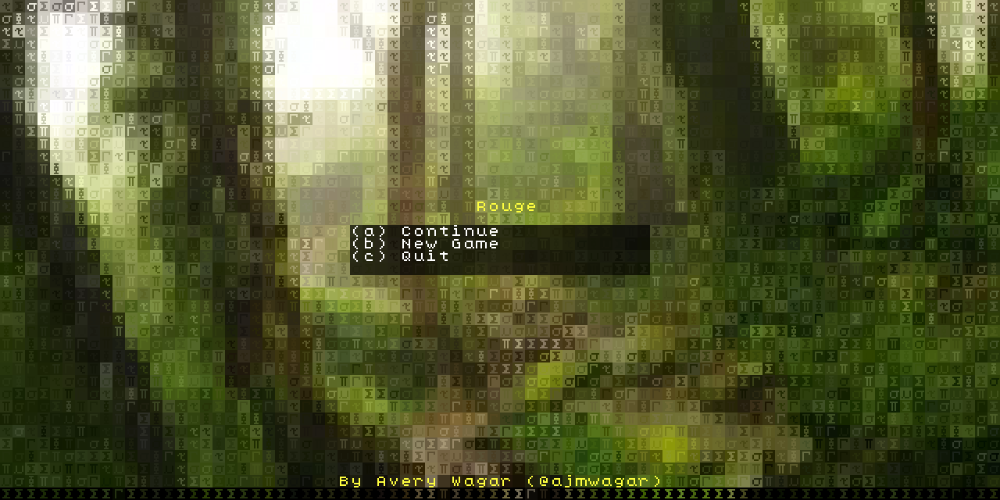
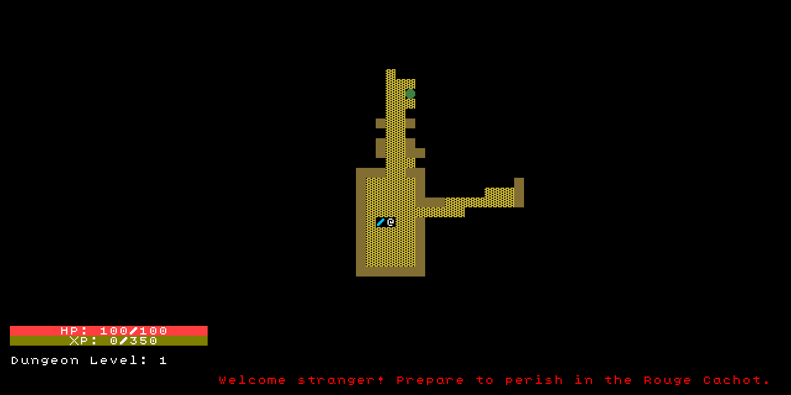
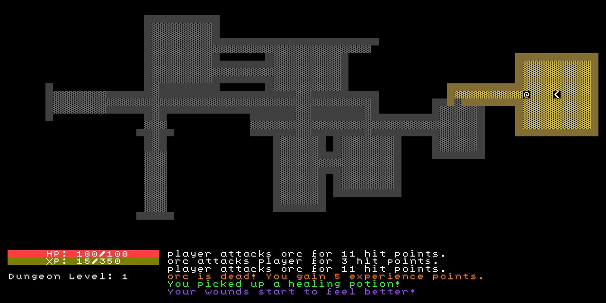

# rouge (red in french) (working title)

A small procedural rouge-like written in Rust.

## Screenshots 





## Installation

```bash
git clone https://github.com/ajmwagar/rouge
cd rouge
cargo run --release
```

**OR**

```bash
cargo install --path ./
rouge
```

## Rules of the rouge

- Permadeath (single life)
- Gear up with swords, potions, and spells!
- Fight deeper into the dungeon to unlock it's secrets
- Infinite **procedural** levels. Difficulty progresses over time. (So does the story)

## Controls

Rouge's controls are pretty simple.

The defaults are as follows:

- `<`: Descend staircase
- `i`: open inventory
- `c`: open character menu
- `Arrow Keys`: Movement
- `Numpad`: Movement + Diagonal Attack + Pass turn
- `esc`: return to main menu (and save)

__Note:__ you can mouse over a square to see the items in it.

